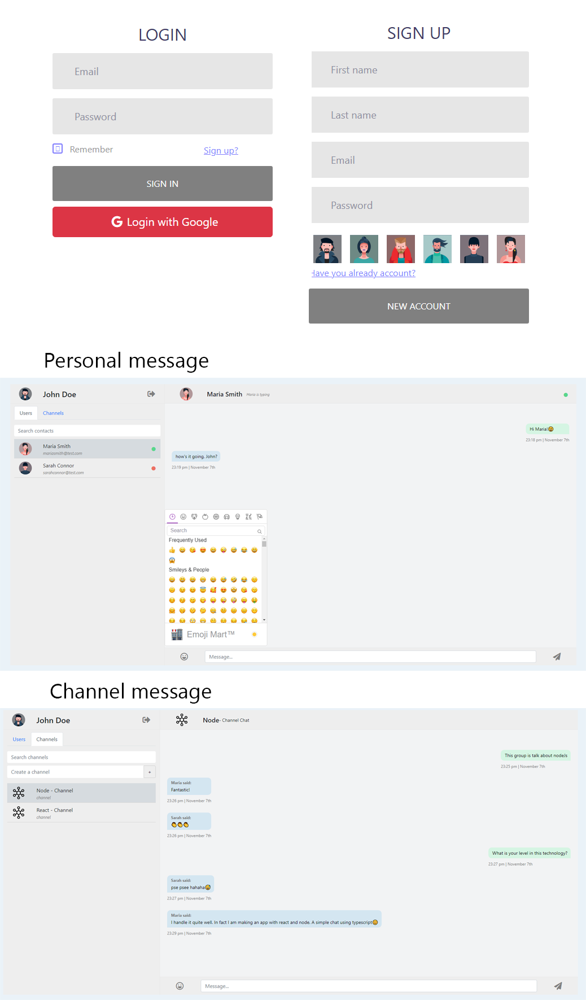

## Set environment variables
By default, I leave the .env files.  
The data of my Google account will be temporarily for testing


## What will you have to do
You will have to go to the google developers part and create an app.
In the ENV file, you will change the data for yours.
Remember to add the redirect route in your Google app

### Server:

```
PORT=8080
MONGO_URL=mongodb://localhost:27017/chat
JWT_KEY=somesecretkey
GOOGLE_CLIENT_SECRET=rDnriG3Oj4as9ffwIRbSQjvI
GOOGLE_CLIENT_ID=16144020241-36ep3gt7lh0i8252l6fepr70qhdffnka.apps.googleusercontent.com
GOOGLE_REDIRECT_URI=http://localhost:3000
```

### Client:
```
REACT_APP_API_URL=http://localhost:8080/api
REACT_APP_GOOGLE_ID=16144020241-36ep3gt7lh0i8252l6fepr70qhdffnka.apps.googleusercontent.com
REACT_APP_GOOGLE_REDIRECT_URI=http://localhost:3000
```
## How to initialize

### Server:
```
cd server
npm install
npm run dev
```

### Client:
```
cd client
npm install
npm start
```

## How to use


- You can register with email
- You can register/login with Google
- You can see when a user is typing in real time
- You can see if the user is connected or not
- You can send emoticons
- You can create a channel and everyone write to it

Trick to test:  
Open an incognito browser window to chat with yourself!  
You can also open another browser, like Brave, and try a third person to chat.




---

This project was created:  
Client 
```
npx create-react-app client --template typescript
```

Server

```
npm i typescript & npx tsc --init
```

This exercise has been done using React and typescript.  
A very practical Udemy course has been followed.  
https://www.udemy.com/course/react-socket-io-fernando/